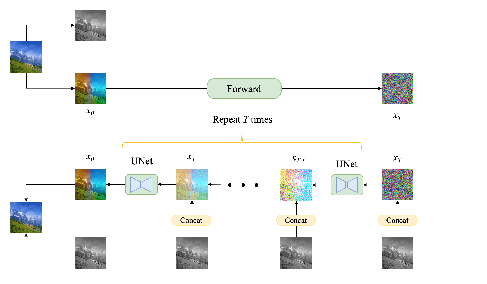

# Diffusion Colorization
A simple implementation of Diffusion-based Image Colorization.

## References
- [x] Chitwan Saharia. [Palette: Image-to-Image Diffusion Models](https://arxiv.org/pdf/2111.05826.pdf). CVPR 2021.

## Simple Idea

## Run
Please conduct tests and adjust parameters based on the notebook file in the **example** folder.
